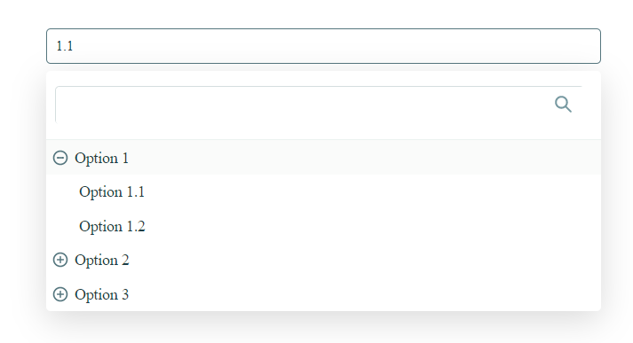

# DropdownTreeSearchSelect

DropdownTreeSearchSelect - This is a simple React component for creating a nested dropdown list with search.



## Installation

```bash
npm install --save dropdown-tree-search-select

```

## Usage

```js
import DropdownTreeSearchSelect from 'dropdown-tree-search-select'

    class App extends React.Component {
  constructor(props) {
    super(props)

    this.state = { setOption: null }
  }
  get options() {
    return [{
      text: 'Option 1',
      child: [
        {
          text: 'Option 1.1',
          value: '1.1',
        },
        {
          text: 'Option 1.2',
          value: '1.2',
        },
      ],
    },
  ]
  }
    render() {
        return (
            <DropdownTreeSearchSelect
              onChange={(e) => this.setState({ setOption: e })}
              value={this.state?.setOption.value}
              options={this.options}
            />
        )
    }
}
```

##  Props

| Name | Mandatory  | Type  | Description |
| :----| :--------  |:----  |:----------  |
| `onChange` | `yes` | `function`  | The function is called when the current value changes. Gets the object of the selected option. Like: {text: 'Option 1.1', value: '1.1'}
| `options` | `yes` | `array` | An array of objects with a couple of properties (see example above)
| `value` | `yes` | `string` | Value of the current item (which will be displayed on the screen)
| `nullOption` | `no` | `string` | The value that will be displayed when the value has not been set (null op undefined)
| `className` | `no` | `string` | Class name to override properties
```